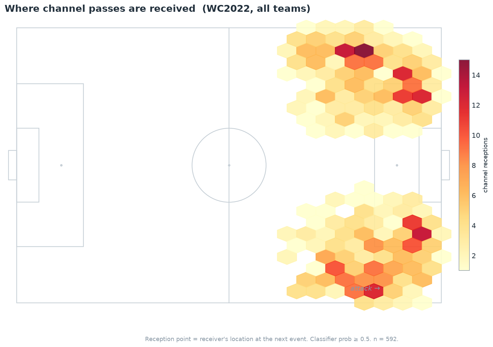
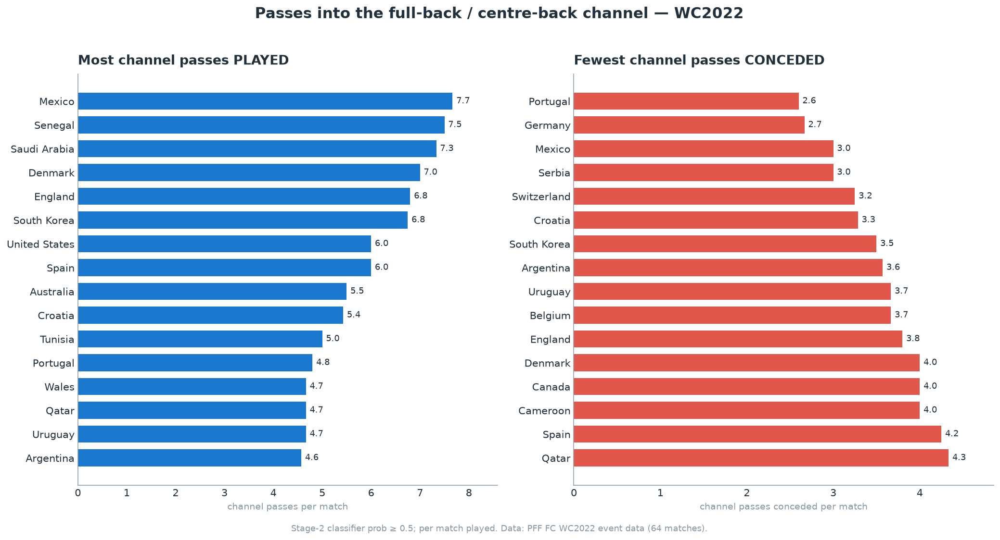
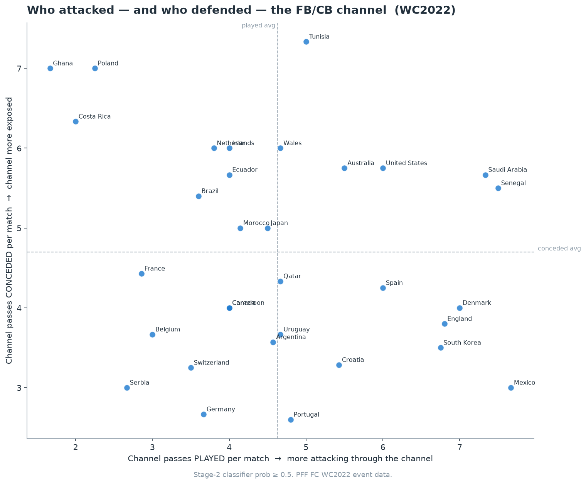
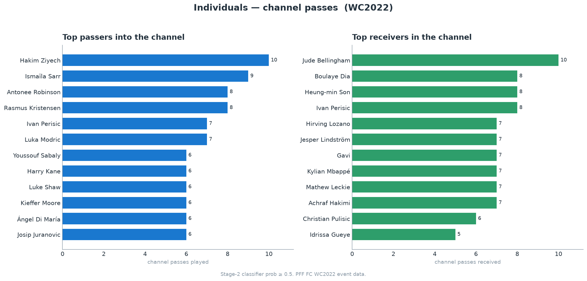
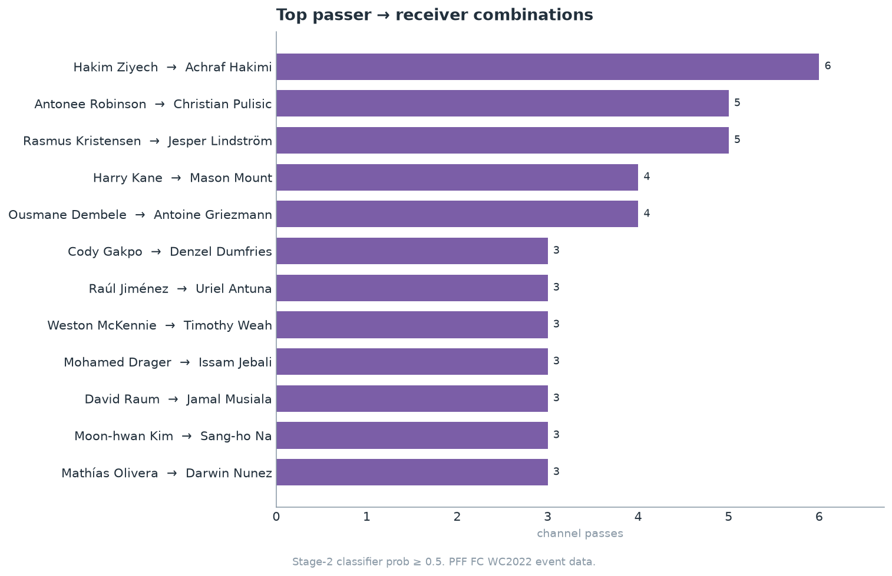

# Passes into the channel — WC2022

**Detecting and ranking passes into the full-back / centre-back channel from event data alone.**

The *channel* is the gap between a defending full-back (or wing-back) and the
nearest centre-back. A pass received there — behind the defensive line, out in
the wide channel or half-space — is one of the most dangerous entries in the
modern game, but no public dataset labels it. This project builds a **two-stage
detector** for it and applies it to all **64 matches of the 2022 World Cup**,
using only PFF FC event data (no tracking required).



The receptions land exactly where the concept predicts — the two wide channels
just outside and inside the penalty area — which is the first sanity check that
the detector is measuring what it claims to.

---

## The two-stage pipeline

Hand-tuned geometry alone plateaus (every threshold tweak fixes some cases and
breaks others). A pure classifier needs candidates to score. So the detector
separates the two jobs:

```
                 ┌───────────────────────────┐      ┌──────────────────────────┐
  64 matches  →  │  STAGE 1 — geometry       │  →   │  STAGE 2 — classifier    │  →  ranked
  event data     │  high-recall candidates   │      │  precision filter        │      channel
                 │  (label-free, spatial)    │      │  (logistic regression)   │      passes
                 └───────────────────────────┘      └──────────────────────────┘
                        2,226 candidates                 scored 0–1 probability
```

### Stage 1 — spatial candidate generator (`src/channel.py`)

Modern defending is positionally fluid, so the last line is found **from
coordinates, not position labels**: it is the rearmost spatial band of the
defending outfielders (everyone within 10 m of the deepest, adapting to
back-3/4/5 and to midfielders dropping in). A candidate is a pass **received**
- behind that last line,
- in a real lateral gap (isolated ≥ 3 m from the nearest line defender),
- out in the channel/half-space (not dead central),
- in the final third.

The reception point is the receiver's location **at the next event** (the run
onto the ball), which is far more reliable than the next event's ball position.
This stage returns **2,226 candidates** across 64 matches — deliberately
high-recall.

### Stage 2 — supervised classifier (`scripts/channel_classifier.py`)

Each candidate is scored by a logistic-regression model trained on hand-labelled
gold data, using spatial features: depth behind the line, isolation distance,
reception x/y, pass length, the passer's position relative to the line, receiver
run magnitude, and the pass type. The probability turns the noisy candidate set
into a ranked, filterable list.

**Cross-validation (GroupKFold, leave-one-match-out):**

| Model | AUC | Precision | Recall | F1 |
|-------|-----|-----------|--------|-----|
| **Logistic Regression** | **0.71** ± 0.14 | 0.44 | 0.70 | **0.51** |
| HistGBM | 0.71 ± 0.16 | 0.43 | 0.30 | 0.35 |

Logistic regression is the chosen model — with only 203 labelled rows the
gradient-boosting model overfits (it collapses to all-negative on several folds).
The most informative signals match football intuition:

- **passer must be wide** (largest positive weight),
- **moderate isolation beats extreme isolation** — a true channel reception sits
  *between* two defenders; a reception in wide-open space is usually a through
  ball, not a channel entry,
- **a passer already past the defensive line is less likely** a true channel
  entry — confirming a pattern spotted while labelling.

---

## Results (WC2022, 64 matches)

A pass is counted as a channel pass when the Stage-2 probability ≥ 0.5; team
numbers are per match played (teams played 3–7 games).

### Teams





The scatter separates the tournament cleanly: bottom-right teams (Mexico, South
Korea, Croatia, England, Denmark) attacked the channel often while conceding it
rarely; top-left teams (Ghana, Poland, Costa Rica) did the opposite.

### Players & combinations





The leaderboards are dominated by exactly the players you'd expect — wide
creators and overlapping full-backs feeding wingers and attacking mids. The
top combination, **Hakim Ziyech → Achraf Hakimi**, was Morocco's signature
right-flank pattern on their run to the semi-finals.

---

## Reproduce

The figures and model are fully reproducible from the scored candidate table
already in this repo (`outputs/channel_passes_scored.csv`, a few hundred KB) — no
raw data needed:

```bash
pip install -r requirements.txt
python scripts/make_figures.py          # regenerate every figure
python scripts/channel_classifier.py    # retrain + re-score (needs gold labels)
```

To re-run **Stage 1** from scratch you need the raw PFF FC WC2022 event data
(see *Data* below) placed under `data/`:

```bash
python scripts/extract_channels.py --workers 8
```

```
src/channel.py               Stage 1 — spatial candidate generator
src/data_loader.py           PFF event/metadata loaders (event-only)
src/viz.py                   pitch drawing + plot style
scripts/extract_channels.py  run Stage 1 over all 64 matches
scripts/channel_classifier.py  Stage 2 — train, cross-validate, score
scripts/make_figures.py      build all portfolio figures
outputs/                     scored candidates, gold labels, figures
```

---

## Limitations (read this)

This is an honest proof-of-concept, not a production model:

- **Gold labels cover Argentina's 7 matches only.** They were produced by manual
  video review, and the publicly available full-match footage was limited to
  those games from Fifa+. The model's generalisation to other teams' styles is
  therefore **unvalidated** — the headline CV number should be read as
  indicative, not definitive.
- **Negatives are partly "weak".** Most negatives are candidates the reviewer
  saw but did not flag as channel passes, rather than independently verified
  false-positives. Treat precision as a lower bound.
- **Small sample.** 116 gold labels (64 positive). More labels — especially from
  non-Argentina matches — would tighten the model and reduce the fold-to-fold
  variance.

The **Stage-1 geometric detector** is the more robust contribution: it is
transparent, parameter-light, and reproducible, and on held-out matches it
flagged genuine channel receptions with high precision. Stage 2 is a promising
refinement that more labelled data would sharpen.

---

## A note on terminology

The space between a full-back and a centre-back is most precisely called the
**channel** in English football. It is *not* the same as a **half-space** (one of
the five vertical zones of the pitch, defined by pitch geography), although a
channel pass can be played *into* a half-space — that is exactly the `Type2_halfspace`
subtype here. The other subtypes are `Type1_wide` (passer by the touchline) and
`Type3_switch` (after a switch of play).

---

## Data

Built on **PFF FC's free 2022 World Cup release** (event + metadata for all 64
matches). The data is not redistributed here. Request access from PFF FC and
place it under `data/` in either layout the loader supports:

```
data/Metadata/{match_id}.json
data/Event Data/{match_id}.json
```

---

*Methodology and findings: I welcome feedback and corrections.*
